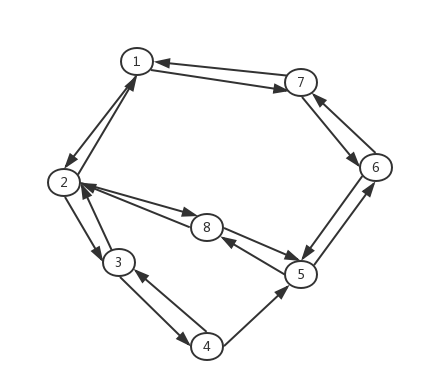

# Arthur/Graph-RoadNet-Matlab
  
*@ArthurPang  Matlab*

## 背景
- 实际小区的路径地图，需要确定各区域之间的所有路径
- 需要求得任意两区域之间的相通的路径，各路径均有方向
- 使用Matlab的cell元胞保存路径数组

## 问题分析
- 本质为有向图寻找两点之间的所有路径的问题
- 主要关注图中各路径之间的节点，到达区域的最后一条路径相对固定。
- 将原路径地图抽象为以下图(8个节点)，使用有向图DFS（深度优先遍历）进行基本的算法设计  
  

  
算法思想
-------
- 对于图中给定的起始两点，将起点入栈
- 设置其入栈标志
- DFS搜索其可达的点，若其尚未入栈，且从当前点即栈顶点出发尚未访问过该点，将其入栈，并设置访问标志及入栈标志
- 若当前点为目标点，则将该点出栈
- 当当前点无可访问点即无可入栈点时，将该点从栈中弹出，并清空其已访问点列表。
- 重复以上步骤，当栈为空时算法结束。  

数据结构
----
  
- 使用Matlab实现，主要用到其**矩阵及cell数组**
- 关于有向图，使用邻接矩阵(8*8)表示，Map[i][j]表示从i->j的路径
  ```
  Map=[0	19	0	0	0	0	29	0;
  20	0	21	0	0	0	0	25;
  0	22	0	23	0	0	0	0;
  0	0	24	0	33	0	0	0;
  0	0	0	34	0	35	0	28;
  0	0	0	0	36	0	32	0;
  30	0	0	0	0	31	0	0;
  0	26	0	0	27	0	0	0];
  ```
- 栈使用数组表示，用一个数字记录当前数组的长度，即栈顶的位置，并初始化一个全0数组，标识各点为入栈
  ```
  vflag=zeros(Node,1);
  %临时结果矩阵
  Tmp=zeros(8,8);
  stack=[];
  %起始遍历节点
  stack=[stack,startNode];
  p=1;
  vflag(startNode)=1;
  ```
  
- 使用邻接矩阵记录各点的访问清空，Visited[i][j]表示从i->j该路径已经遍历过
  ```
  Visited=[0	0	0	0	0	0	0	0;
  0	0	0	0	0	0	0	0;
  0	0	0	0	0	0	0	0;
  0	0	0	0	0	0	0	0;
  0	0	0	0	0	0	0	0;
  0	0	0	0	0	0	0	0;
  0	0	0	0	0	0	0	0;
  0	0	0	0	0	0	0	0];
  ```
